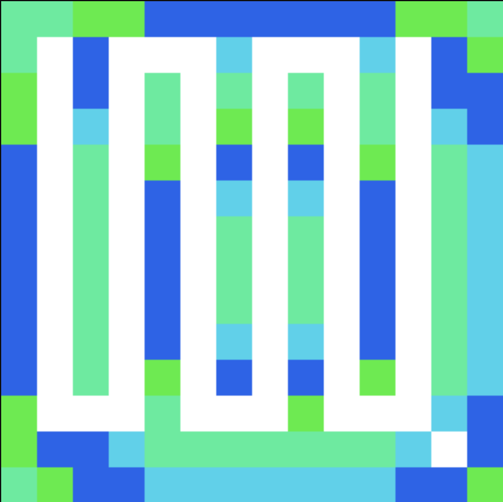

# Ethereum-Powered Maze Art Generator

This project generates unique maze-based artwork inspired by the blockchain activity of an Ethereum address. The artwork is dynamically created by fetching Ethereum transaction data for a given address, adjusting the maze's color scheme, and complexity based on that data.

<p align="center">
  
</p>

## Generate Your Own Maze Art

To start generating your maze art, follow these steps:

1. Clone the repository to your local machine:

   ```bash
   git clone https://github.com/chiragbadhe/ethereum-maze-art.git
   cd ethereum-maze-art
   ```

2. Install the necessary dependencies:

   ```bash
   bun install
   ```

3. Run the development server:

   ```bash
   bun dev
   ```

4. Once the server is running, you can generate your own maze art by visiting the following URL:

   ```
   http://localhost:3000/?address=<ethereum-address>&data=<optional-custom-data>
   ```

   Example:

   ```
   http://localhost:3000/?address=0x55A4696Ba64F8a050632b19AeF734E30E85f5Dfc&data=anydatahere
   ```
## Features

- **Customizable**: You can use any valid Ethereum address and an optional custom data string to modify the maze.
- **Real-Time Rendering**: The maze updates every time you change the address or data parameters.
- **Blockchain Integration**: The maze's complexity is influenced by real-world blockchain data, such as the transaction count of the given Ethereum address.

## Requirements

- Bun runtime
- Next.js with the `next/og` and `viem` libraries for Ethereum blockchain interactions